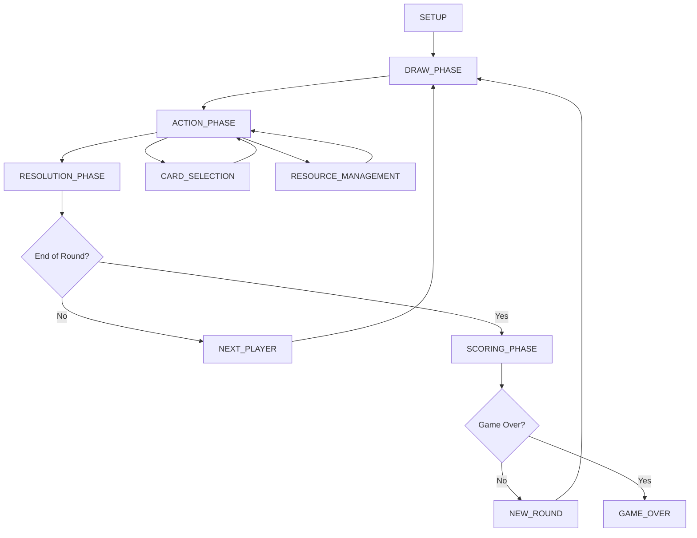

# Game Flow Management System

## Overview

The game flow management system is a centralized state management solution that orchestrates the entire game lifecycle, from initial setup through completion. It manages game phases, player interactions, state transitions, and component coordination using a Redux-like store pattern.

## Architecture

### Core Components

```
┌─────────────────┐    ┌─────────────────┐    ┌─────────────────┐
│   GameStore     │    │  FlowManager    │    │  Components     │
│                 │◄──►│                 │◄──►│                 │
│ - State         │    │ - Transitions   │    │ - UI Updates    │
│ - Actions       │    │ - Validation    │    │ - User Input    │
│ - Reducers      │    │ - Side Effects  │    │ - Rendering     │
└─────────────────┘    └─────────────────┘    └─────────────────┘
         │                       │                       │
         └───────────────────────┼───────────────────────┘
                                 │
                    ┌─────────────────┐
                    │   Event Bus     │
                    │                 │
                    │ - Notifications │
                    │ - Logging       │
                    │ - Analytics     │
                    └─────────────────┘
```

### State Structure

```typescript
interface GameState {
  // Game metadata
  gameId: string;
  sessionId: string;
  timestamp: number;
  
  // Current phase and flow control
  currentPhase: GamePhase;
  previousPhase: GamePhase | null;
  phaseHistory: GamePhase[];
  isTransitioning: boolean;
  
  // Player state
  players: Player[];
  currentPlayer: number;
  playerOrder: number[];
  
  // Game-specific state
  board: BoardState;
  cards: CardState;
  resources: ResourceState;
  
  // UI and interaction state
  selectedCards: string[];
  availableActions: Action[];
  pendingConfirmations: Confirmation[];
  
  // Game progress
  round: number;
  turn: number;
  score: ScoreState;
  isGameOver: boolean;
  winner: string | null;
}
```

## Game Phases

### Phase Diagram



### Phase Definitions

```typescript
enum GamePhase {
  // Initial setup
  SETUP = 'setup',
  PLAYER_JOIN = 'player_join',
  INITIAL_DRAW = 'initial_draw',
  
  // Main game loop
  DRAW_PHASE = 'draw_phase',
  ACTION_PHASE = 'action_phase',
  CARD_SELECTION = 'card_selection',
  RESOURCE_MANAGEMENT = 'resource_management',
  RESOLUTION_PHASE = 'resolution_phase',
  
  // End of turn/round
  NEXT_PLAYER = 'next_player',
  SCORING_PHASE = 'scoring_phase',
  NEW_ROUND = 'new_round',
  
  // Game completion
  GAME_OVER = 'game_over',
  
  // Error states
  ERROR = 'error',
  DISCONNECTED = 'disconnected'
}
```

## Store API and Actions

### Core Store Methods

```typescript
class GameStore {
  // State access
  getState(): GameState;
  subscribe(listener: (state: GameState) => void): () => void;
  
  // Action dispatch
  dispatch(action: GameAction): void;
  
  // Phase management
  getCurrentPhase(): GamePhase;
  canTransitionTo(phase: GamePhase): boolean;
  transitionTo(phase: GamePhase, payload?: any): void;
  
  // Player management
  getCurrentPlayer(): Player;
  getNextPlayer(): Player;
  isPlayerTurn(playerId: string): boolean;
}
```

### Action Types

```typescript
// Phase transition actions
interface TransitionPhaseAction {
  type: 'TRANSITION_PHASE';
  payload: {
    from: GamePhase;
    to: GamePhase;
    playerId?: string;
    metadata?: any;
  };
}

// Player actions
interface PlayerJoinAction {
  type: 'PLAYER_JOIN';
  payload: {
    player: Player;
    position?: number;
  };
}

interface NextPlayerAction {
  type: 'NEXT_PLAYER';
  payload: {
    currentPlayer: number;
    nextPlayer: number;
  };
}

// Game state actions
interface UpdateBoardAction {
  type: 'UPDATE_BOARD';
  payload: {
    boardState: Partial<BoardState>;
    playerId: string;
  };
}

interface DrawCardsAction {
  type: 'DRAW_CARDS';
  payload: {
    playerId: string;
    cards: Card[];
    count: number;
  };
}

interface PlayCardAction {
  type: 'PLAY_CARD';
  payload: {
    playerId: string;
    card: Card;
    target?: any;
  };
}
```

### Action Creators

```typescript
// Phase management
export const transitionPhase = (to: GamePhase, from?: GamePhase, metadata?: any) => ({
  type: 'TRANSITION_PHASE',
  payload: { from: from || getCurrentPhase(), to, metadata }
});

export const startGame = () => transitionPhase(GamePhase.DRAW_PHASE, GamePhase.SETUP);
export const endTurn = () => transitionPhase(GamePhase.NEXT_PLAYER, GamePhase.RESOLUTION_PHASE);
export const startNewRound = () => transitionPhase(GamePhase.NEW_ROUND, GamePhase.SCORING_PHASE);

// Player actions
export const joinPlayer = (player: Player, position?: number) => ({
  type: 'PLAYER_JOIN',
  payload: { player, position }
});

export const nextPlayer = () => ({
  type: 'NEXT_PLAYER',
  payload: {
    currentPlayer: getCurrentPlayerIndex(),
    nextPlayer: getNextPlayerIndex()
  }
});

// Game actions
export const drawCards = (playerId: string, count: number = 1) => ({
  type: 'DRAW_CARDS',
  payload: { playerId, count, cards: drawFromDeck(count) }
});

export const playCard = (playerId: string, card: Card, target?: any) => ({
  type: 'PLAY_CARD',
  payload: { playerId, card, target }
});

export const updateScore = (playerId: string, points: number, reason: string) => ({
  type: 'UPDATE_SCORE',
  payload: { playerId, points, reason, timestamp: Date.now() }
});
```

## Phase Transition Logic

### Transition Rules

```typescript
class PhaseTransitionManager {
  private transitionRules: Map<GamePhase, GamePhase[]> = new Map([
    [GamePhase.SETUP, [GamePhase.PLAYER_JOIN, GamePhase.INITIAL_DRAW]],
    [GamePhase.PLAYER_JOIN, [GamePhase.SETUP, GamePhase.INITIAL_DRAW]],
    [GamePhase.INITIAL_DRAW, [GamePhase.DRAW_PHASE]],
    [GamePhase.DRAW_PHASE, [GamePhase.ACTION_PHASE]],
    [GamePhase.ACTION_PHASE, [GamePhase.CARD_SELECTION, GamePhase.RESOURCE_MANAGEMENT, GamePhase.RESOLUTION_PHASE]],
    [GamePhase.CARD_SELECTION, [GamePhase.ACTION_PHASE, GamePhase.RESOLUTION_PHASE]],
    [GamePhase.RESOURCE_MANAGEMENT, [GamePhase.ACTION_PHASE, GamePhase.RESOLUTION_PHASE]],
    [GamePhase.RESOLUTION_PHASE, [GamePhase.NEXT_PLAYER, GamePhase.SCORING_PHASE]],
    [GamePhase.NEXT_PLAYER, [GamePhase.DRAW_PHASE]],
    [GamePhase.SCORING_PHASE, [GamePhase.NEW_ROUND, GamePhase.GAME_OVER]],
    [GamePhase.NEW_ROUND, [GamePhase.DRAW_PHASE]],
    [GamePhase.GAME_OVER, []],
    [GamePhase.ERROR, [GamePhase.SETUP]],
    [GamePhase.DISCONNECTED, [GamePhase.SETUP, GamePhase.DRAW_PHASE]]
  ]);

  canTransition(from: GamePhase, to: GamePhase): boolean {
    const allowedTransitions = this.transitionRules.get(from) || [];
    return allowedTransitions.includes(to);
  }

  validateTransition(from: GamePhase, to: GamePhase, state: GameState): boolean {
    if (!this.canTransition(from, to)) {
      return false;
    }

    // Phase-specific validation logic
    switch (to) {
      case GamePhase.DRAW_PHASE:
        return state.players.length >= 2;
        
      case GamePhase.ACTION_PHASE:
        return state.players[state.currentPlayer].hand.length > 0;
        
      case GamePhase.RESOLUTION_PHASE:
        return state.selectedCards.length > 0 || state.availableActions.length === 0;
        
      case GamePhase.SCORING_PHASE:
        return this.isEndOfRound(state);
        
      case GamePhase.GAME_OVER:
        return this.isGameComplete(state);
        
      default:
        return true;
    }
  }
}
```

### Transition Middleware

```typescript
const phaseTransitionMiddleware: Middleware = (store) => (next) => (action) => {
  if (action.type === 'TRANSITION_PHASE') {
    const state = store.getState();
    const { from, to } = action.payload;
    
    // Validate transition
    if (!transitionManager.validateTransition(from, to, state)) {
      console.error(`Invalid transition from ${from} to ${to}`);
      return;
    }
    
    // Execute pre-transition hooks
    executePreTransitionHooks(from, to, state);
    
    // Dispatch the transition
    const result = next(action);
    
    // Execute post-transition hooks
    executePostTransitionHooks(from, to, store.getState());
    
    return result;
  }
  
  return next(action);
};
```

## Component Integration

### Game Flow Provider

```typescript
import React, { createContext, useContext, useReducer, useEffect } from 'react';

interface GameFlowContextType {
  state: GameState;
  dispatch: (action: GameAction) => void;
  currentPhase: GamePhase;
  canTransitionTo: (phase: GamePhase) => boolean;
  transitionTo: (phase: GamePhase, metadata?: any) => void;
}

const GameFlowContext = createContext<GameFlowContextType | null>(null);

export const GameFlowProvider: React.FC<{ children: React.ReactNode }> = ({ children }) => {
  const [state, dispatch] = useReducer(gameFlowReducer, initialGameState);
  
  const currentPhase = state.currentPhase;
  
  const canTransitionTo = (phase: GamePhase): boolean => {
    return transitionManager.canTransition(currentPhase, phase);
  };
  
  const transitionTo = (phase: GamePhase, metadata?: any): void => {
    dispatch(transitionPhase(phase, currentPhase, metadata));
  };
  
  // Set up phase change listeners
  useEffect(() => {
    const unsubscribe = subscribeToPhaseChanges((newPhase, oldPhase) => {
      console.log(`Phase transition: ${oldPhase} → ${newPhase}`);
      // Handle side effects, logging, analytics, etc.
    });
    
    return unsubscribe;
  }, []);
  
  const contextValue: GameFlowContextType = {
    state,
    dispatch,
    currentPhase,
    canTransitionTo,
    transitionTo
  };
  
  return (
    <GameFlowContext.Provider value={contextValue}>
      {children}
    </GameFlowContext.Provider>
  );
};

export const useGameFlow = (): GameFlowContextType => {
  const context = useContext(GameFlowContext);
  if (!context) {
    throw new Error('useGameFlow must be used within a GameFlowProvider');
  }
  return context;
};
```

### Phase-Specific Components

```typescript
// Component that renders based on current phase
export const PhaseRenderer: React.FC = () => {
  const { currentPhase, state } = useGameFlow();
  
  switch (currentPhase) {
    case GamePhase.SETUP:
      return <SetupPhase />;
      
    case GamePhase.PLAYER_JOIN:
      return <PlayerJoinPhase players={state.players} />;
      
    case GamePhase.DRAW_PHASE:
      return <DrawPhase currentPlayer={state.players[state.currentPlayer]} />;
      
    case GamePhase.ACTION_PHASE:
      return <ActionPhase 
        currentPlayer={state.players[state.currentPlayer]}
        availableActions={state.availableActions}
      />;
      
    case GamePhase.CARD_SELECTION:
      return <CardSelectionPhase 
        hand={state.players[state.currentPlayer].hand}
        selectedCards={state.selectedCards}
      />;
      
    case GamePhase.RESOLUTION_PHASE:
      return <ResolutionPhase />;
      
    case GamePhase.SCORING_PHASE:
      return <ScoringPhase scores={state.score} />;
      
    case GamePhase.GAME_OVER:
      return <GameOverPhase winner={state.winner} finalScores={state.score} />;
      
    default:
      return <div>Unknown phase: {currentPhase}</div>;
  }
};

// Hook for phase-specific logic
export const usePhaseLogic = (phase: GamePhase) => {
  const { currentPhase, state, dispatch } = useGameFlow();
  const isCurrentPhase = currentPhase === phase;
  
  useEffect(() => {
    if (isCurrentPhase) {
      // Execute phase entry logic
      onPhaseEnter(phase, state, dispatch);
      
      return () => {
        // Execute phase exit logic
        onPhaseExit(phase, state, dispatch);
      };
    }
  }, [isCurrentPhase, phase, state, dispatch]);
  
  return {
    isActive: isCurrentPhase,
    canEnter: transitionManager.canTransition(currentPhase, phase),
    enter: () => dispatch(transitionPhase(phase)),
    state
  };
};
```

## Usage Examples

### Basic Game Setup

```typescript
import React from 'react';
import { GameFlowProvider, PhaseRenderer } from './game-flow';

const GameApp: React.FC = () => {
  return (
    <GameFlowProvider>
      <div className="game-container">
        <GameHeader />
        <PhaseRenderer />
        <GameFooter />
      </div>
    </GameFlowProvider>
  );
};

export default GameApp;
```

### Custom Phase Component

```typescript
import React from 'react';
import { useGameFlow, usePhaseLogic } from '../game-flow';

const DrawPhase: React.FC = () => {
  const { state, dispatch } = useGameFlow();
  const { isActive } = usePhaseLogic(GamePhase.DRAW_PHASE);
  
  const currentPlayer = state.players[state.currentPlayer];
  
  const handleDrawCards = (count: number) => {
    dispatch(drawCards(currentPlayer.id, count));
    // Automatically transition to action phase after drawing
    setTimeout(() => {
      dispatch(transitionPhase(GamePhase.ACTION_PHASE));
    }, 1000);
  };
  
  if (!isActive) {
    return null;
  }
  
  return (
    <div className="draw-phase">
      <h2>Draw Phase - {currentPlayer.name}</h2>
      <p>Cards in hand: {currentPlayer.hand.length}</p>
      <p>Cards remaining in deck: {state.cards.deck.length}</p>
      
      <button 
        onClick={() => handleDrawCards(1)}
        disabled={state.cards.deck.length === 0}
      >
        Draw 1 Card
      </button>
      
      <button 
        onClick={() => handleDrawCards(2)}
        disabled={state.cards.deck.length < 2}
      >
        Draw 2 Cards
      </button>
    </div>
  );
};
```

### Action Phase with State Management

```typescript
const ActionPhase: React.FC = () => {
  const { state, dispatch, transitionTo } = useGameFlow();
  const currentPlayer = state.players[state.currentPlayer];
  
  const handlePlayCard = (card: Card) => {
    dispatch(playCard(currentPlayer.id, card));
    
    // Check if turn should end
    if (shouldEndTurn(state)) {
      transitionTo(GamePhase.RESOLUTION_PHASE);
    }
  };
  
  const handleResourceAction = (action: ResourceAction) => {
    dispatch(performResourceAction(currentPlayer.id, action));
  };
  
  const handleEndTurn = () => {
    transitionTo(GamePhase.RESOLUTION_PHASE);
  };
  
  return (
    <div className="action-phase">
      <PlayerHand 
        cards={currentPlayer.hand}
        onCardPlay={handlePlayCard}
        selectedCards={state.selectedCards}
      />
      
      <ResourcePanel 
        resources={currentPlayer.resources}
        onResourceAction={handleResourceAction}
      />
      
      <ActionButtons>
        <button onClick={handleEndTurn}>
          End Turn
        </button>
      </ActionButtons>
      
      <GameBoard 
        board={state.board}
        currentPlayer={currentPlayer}
      />
    </div>
  );
};
```

### Phase Transition Hooks

```typescript
// Custom hook for handling phase transitions
export const usePhaseTransitions = () => {
  const { currentPhase, state, dispatch } = useGameFlow();
  
  const goToNextPhase = useCallback(() => {
    const nextPhase = determineNextPhase(currentPhase, state);
    if (nextPhase) {
      dispatch(transitionPhase(nextPhase));
    }
  }, [currentPhase, state, dispatch]);
  
  const skipToPhase = useCallback((targetPhase: GamePhase) => {
    if (transitionManager.canTransition(currentPhase, targetPhase)) {
      dispatch(transitionPhase(targetPhase));
    } else {
      console.warn(`Cannot skip to phase ${targetPhase} from ${currentPhase}`);
    }
  }, [currentPhase, dispatch]);
  
  return {
    goToNextPhase,
    skipToPhase,
    currentPhase,
    isTransitioning: state.isTransitioning
  };
};

// Usage in component
const GameControls: React.FC = () => {
  const { goToNextPhase, skipToPhase, currentPhase } = usePhaseTransitions();
  
  return (
    <div className="game-controls">
      <button onClick={goToNextPhase}>
        Next Phase
      </button>
      
      {currentPhase !== GamePhase.GAME_OVER && (
        <button onClick={() => skipToPhase(GamePhase.SCORING_PHASE)}>
          Skip to Scoring
        </button>
      )}
    </div>
  );
};
```

### State Persistence and Recovery

```typescript
// Save and restore game state
export const useGamePersistence = () => {
  const { state, dispatch } = useGameFlow();
  
  const saveGame = useCallback(() => {
    const saveData = {
      ...state,
      timestamp: Date.now(),
      version: '1.0.0'
    };
    
    localStorage.setItem('gameState', JSON.stringify(saveData));
  }, [state]);
  
  const loadGame = useCallback(() => {
    const savedData = localStorage.getItem('gameState');
    if (savedData) {
      try {
        const gameState = JSON.parse(savedData);
        dispatch({ type: 'RESTORE_GAME_STATE', payload: gameState });
        return true;
      } catch (error) {
        console.error('Failed to load game state:', error);
        return false;
      }
    }
    return false;
  }, [dispatch]);
  
  const clearSave = useCallback(() => {
    localStorage.removeItem('gameState');
  }, []);
  
  return { saveGame, loadGame, clearSave };
};
```

## Best Practices

### 1. Phase Design
- Keep phases focused on single responsibilities
- Ensure clear entry and exit conditions
- Validate all transitions
- Handle edge cases and error states

### 2. State Management
- Keep state immutable
- Use action creators for consistency
- Implement proper error boundaries
- Log state changes for debugging

### 3. Component Architecture
- Use context providers for global game state
- Create phase-specific components
- Implement proper loading states
- Handle component cleanup

### 4. Performance Optimization
- Memoize expensive calculations
- Use React.memo for component optimization
- Batch related state updates
- Implement proper shouldComponentUpdate logic

### 5. Testing
```typescript
// Example test for phase transitions
describe('Game Flow Transitions', () => {
  it('should transition from DRAW_PHASE to ACTION_PHASE', () => {
    const initialState = createGameState({ currentPhase: GamePhase.DRAW_PHASE });
    const action = transitionPhase(GamePhase.ACTION_PHASE);
    
    const newState = gameFlowReducer(initialState, action);
    
    expect(newState.currentPhase).toBe(GamePhase.ACTION_PHASE);
    expect(newState.previousPhase).toBe(GamePhase.DRAW_PHASE);
    expect(newState.phaseHistory).toContain(GamePhase.DRAW_PHASE);
  });
  
  it('should not allow invalid transitions', () => {
    const initialState = createGameState({ currentPhase: GamePhase.SETUP });
    const action = transitionPhase(GamePhase.GAME_OVER);
    
    expect(() => gameFlowReducer(initialState, action)).toThrow('Invalid transition');
  });
});
```

This documentation provides a comprehensive overview of the game flow management system, covering architecture, state management, phase transitions, and practical implementation examples for developers working with the system.