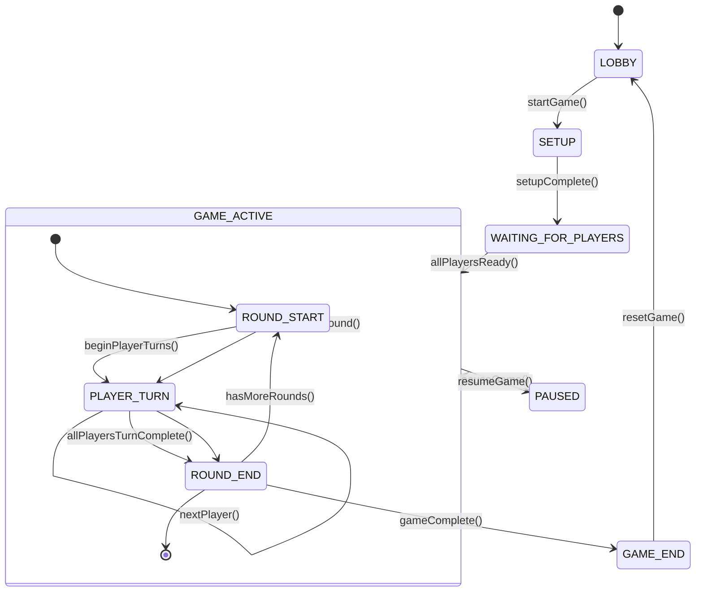

# Game Flow Management System

## Overview

The game flow management system is a comprehensive state management solution that orchestrates the progression of game phases, manages component interactions, and maintains game state consistency. It provides a centralized architecture for handling complex game logic while maintaining clean separation of concerns.

## Architecture

### Core Components

The game flow system consists of several interconnected components:

- **GameFlowStore**: Central state management using Zustand
- **GameFlowProvider**: React context provider for component access
- **PhaseManager**: Handles phase transitions and validation
- **ActionDispatcher**: Manages game actions and side effects
- **StateValidator**: Ensures state consistency

### State Management Architecture

```
┌─────────────────┐
│   Components    │
│                 │
├─────────────────┤
│ GameFlowProvider│
│                 │
├─────────────────┤
│ GameFlowStore   │
│   (Zustand)     │
├─────────────────┤
│  PhaseManager   │
│                 │
├─────────────────┤
│ Action System   │
└─────────────────┘
```

## Game Flow State Diagram



## Store API Reference

### State Structure

```typescript
interface GameFlowState {
  // Phase Management
  currentPhase: GamePhase;
  previousPhase: GamePhase | null;
  phaseHistory: GamePhase[];
  
  // Game Data
  gameId: string | null;
  players: Player[];
  currentPlayer: Player | null;
  currentRound: number;
  maxRounds: number;
  
  // Status Flags
  isLoading: boolean;
  isPaused: boolean;
  isComplete: boolean;
  
  // Metadata
  gameStartTime: Date | null;
  lastAction: string | null;
  metadata: Record<string, any>;
}

type GamePhase = 
  | 'LOBBY'
  | 'SETUP' 
  | 'WAITING_FOR_PLAYERS'
  | 'GAME_ACTIVE'
  | 'ROUND_START'
  | 'PLAYER_TURN'
  | 'ROUND_END'
  | 'PAUSED'
  | 'GAME_END';
```

### Actions API

#### Phase Management Actions

```typescript
interface GameFlowActions {
  // Phase Transitions
  transitionTo: (phase: GamePhase, options?: TransitionOptions) => Promise<void>;
  goToPreviousPhase: () => void;
  
  // Game Lifecycle
  startGame: (config: GameConfig) => Promise<void>;
  endGame: (reason?: string) => void;
  pauseGame: () => void;
  resumeGame: () => void;
  resetGame: () => void;
  
  // Round Management
  startRound: (roundNumber: number) => void;
  endRound: () => void;
  nextRound: () => void;
  
  // Player Management
  addPlayer: (player: Player) => void;
  removePlayer: (playerId: string) => void;
  setCurrentPlayer: (playerId: string) => void;
  nextPlayer: () => void;
  
  // Utility
  updateMetadata: (key: string, value: any) => void;
  validateState: () => boolean;
}
```

#### Action Usage Examples

```typescript
// Starting a game
await gameFlowStore.startGame({
  maxRounds: 5,
  players: playerList,
  gameMode: 'competitive'
});

// Transitioning phases with validation
await gameFlowStore.transitionTo('PLAYER_TURN', {
  validateTransition: true,
  triggerCallbacks: true
});

// Managing rounds
gameFlowStore.startRound(1);
gameFlowStore.nextPlayer();
gameFlowStore.endRound();
```

### Store Selectors

```typescript
// Accessing state with selectors
const currentPhase = useGameFlowStore(state => state.currentPhase);
const isGameActive = useGameFlowStore(state => 
  state.currentPhase === 'GAME_ACTIVE'
);
const currentPlayerName = useGameFlowStore(state => 
  state.currentPlayer?.name || 'No player'
);

// Complex selectors
const gameProgress = useGameFlowStore(state => ({
  round: state.currentRound,
  totalRounds: state.maxRounds,
  percentage: (state.currentRound / state.maxRounds) * 100
}));
```

## Component Integration

### GameFlowProvider Setup

```typescript
import { GameFlowProvider } from './components/game-flow/GameFlowProvider';
import { gameFlowStore } from './stores/gameFlowStore';

function App() {
  return (
    <GameFlowProvider store={gameFlowStore}>
      <GameInterface />
    </GameFlowProvider>
  );
}
```

### Hook Usage in Components

```typescript
import { useGameFlow } from './hooks/useGameFlow';

function GameComponent() {
  const { 
    currentPhase, 
    currentPlayer, 
    actions: { nextPlayer, endRound } 
  } = useGameFlow();

  const handlePlayerAction = async () => {
    // Perform player action
    await performAction();
    
    // Advance game state
    nextPlayer();
  };

  if (currentPhase === 'PLAYER_TURN') {
    return (
      <PlayerTurnInterface 
        player={currentPlayer}
        onAction={handlePlayerAction}
      />
    );
  }

  return <PhaseTransition phase={currentPhase} />;
}
```

### Phase-Specific Components

```typescript
// Component that renders based on game phase
function PhaseRenderer() {
  const currentPhase = useGameFlowStore(state => state.currentPhase);
  
  const phaseComponents = {
    LOBBY: LobbyComponent,
    SETUP: SetupComponent,
    WAITING_FOR_PLAYERS: WaitingComponent,
    GAME_ACTIVE: GameActiveComponent,
    PLAYER_TURN: PlayerTurnComponent,
    GAME_END: GameEndComponent
  };
  
  const CurrentComponent = phaseComponents[currentPhase] || LoadingComponent;
  
  return <CurrentComponent />;
}

// Individual phase component
function PlayerTurnComponent() {
  const { currentPlayer, actions } = useGameFlow();
  const [isThinking, setIsThinking] = useState(false);
  
  const handleTurnComplete = async () => {
    setIsThinking(true);
    
    try {
      // Execute turn logic
      await executeTurn();
      
      // Advance to next player or end round
      if (hasMorePlayers()) {
        actions.nextPlayer();
      } else {
        actions.endRound();
      }
    } finally {
      setIsThinking(false);
    }
  };
  
  return (
    <div className="player-turn">
      <h2>{currentPlayer.name}'s Turn</h2>
      <ActionButtons 
        disabled={isThinking}
        onComplete={handleTurnComplete}
      />
    </div>
  );
}
```

## Phase Transition Logic

### Transition Validation

The system includes comprehensive validation for phase transitions to ensure game integrity:

```typescript
interface TransitionRule {
  from: GamePhase[];
  to: GamePhase;
  validator?: (state: GameFlowState) => boolean;
  sideEffects?: (state: GameFlowState) => void;
}

const transitionRules: TransitionRule[] = [
  {
    from: ['LOBBY'],
    to: 'SETUP',
    validator: (state) => state.players.length >= 2,
    sideEffects: (state) => initializeGameData(state)
  },
  {
    from: ['SETUP'],
    to: 'WAITING_FOR_PLAYERS',
    validator: (state) => state.gameId !== null,
    sideEffects: (state) => notifyPlayers(state.players)
  },
  {
    from: ['WAITING_FOR_PLAYERS'],
    to: 'GAME_ACTIVE',
    validator: (state) => allPlayersReady(state.players),
    sideEffects: (state) => startGameTimer(state)
  }
];
```

### Automatic Transitions

Some transitions occur automatically based on game state:

```typescript
// Auto-transition when conditions are met
useEffect(() => {
  const unsubscribe = gameFlowStore.subscribe(
    (state) => state.players,
    (players) => {
      if (currentPhase === 'WAITING_FOR_PLAYERS' && 
          players.every(p => p.isReady)) {
        gameFlowStore.transitionTo('GAME_ACTIVE');
      }
    }
  );
  
  return unsubscribe;
}, [currentPhase]);
```

### Transition Callbacks

Handle side effects during transitions:

```typescript
const handlePhaseChange = useCallback((newPhase: GamePhase) => {
  const callbacks = {
    GAME_ACTIVE: () => {
      startBackgroundMusic();
      initializeGameUI();
    },
    PLAYER_TURN: () => {
      highlightCurrentPlayer();
      startTurnTimer();
    },
    ROUND_END: () => {
      calculateScores();
      showRoundSummary();
    },
    GAME_END: () => {
      stopBackgroundMusic();
      showFinalResults();
    }
  };
  
  callbacks[newPhase]?.();
}, []);

// Subscribe to phase changes
useEffect(() => {
  return gameFlowStore.subscribe(
    (state) => state.currentPhase,
    handlePhaseChange
  );
}, [handlePhaseChange]);
```

## Advanced Usage Patterns

### Conditional Rendering Based on Phase

```typescript
function ConditionalGameUI() {
  const phase = useGameFlowStore(state => state.currentPhase);
  
  return (
    <>
      {phase === 'GAME_ACTIVE' && <GameTimer />}
      {['PLAYER_TURN', 'ROUND_END'].includes(phase) && <ScoreBoard />}
      {phase === 'PAUSED' && <PauseOverlay />}
      {phase === 'GAME_END' && <ResultsModal />}
    </>
  );
}
```

### Custom Phase Hooks

```typescript
// Hook for phase-specific logic
function usePhaseEffect(phase: GamePhase, effect: () => void | (() => void)) {
  const currentPhase = useGameFlowStore(state => state.currentPhase);
  
  useEffect(() => {
    if (currentPhase === phase) {
      return effect();
    }
  }, [currentPhase, phase, effect]);
}

// Usage
function GameComponent() {
  usePhaseEffect('PLAYER_TURN', () => {
    const timer = setTimeout(() => {
      // Auto-advance after timeout
      gameFlowStore.nextPlayer();
    }, 30000);
    
    return () => clearTimeout(timer);
  });
  
  usePhaseEffect('ROUND_START', () => {
    playSound('round-start');
    showRoundNotification();
  });
}
```

### State Persistence

```typescript
// Persist game state across sessions
const gameFlowStore = create(
  persist(
    (set, get) => ({
      // ... store implementation
    }),
    {
      name: 'game-flow-storage',
      partialize: (state) => ({
        // Only persist essential state
        currentPhase: state.currentPhase,
        players: state.players,
        currentRound: state.currentRound,
        gameId: state.gameId
      })
    }
  )
);
```

## Best Practices

### 1. Phase Management
- Always use the store's transition methods rather than directly setting phase
- Validate transitions to prevent invalid state changes
- Use phase history for undo functionality
- Handle edge cases in transition validation

### 2. Component Design
- Create phase-specific components for better organization
- Use conditional rendering based on phase state
- Implement loading states during phase transitions
- Handle phase transition animations gracefully

### 3. Error Handling
```typescript
// Wrap phase transitions in try-catch
const safeTransition = async (phase: GamePhase) => {
  try {
    await gameFlowStore.transitionTo(phase);
  } catch (error) {
    console.error('Phase transition failed:', error);
    // Fallback to safe state
    gameFlowStore.transitionTo('LOBBY');
  }
};
```

### 4. Performance Optimization
- Use specific selectors to prevent unnecessary re-renders
- Implement memo for phase-specific components
- Debounce rapid state changes

```typescript
// Optimized selector usage
const PlayerList = memo(() => {
  const players = useGameFlowStore(state => state.players);
  return <div>{/* render players */}</div>;
});

// Prevent unnecessary re-renders
const GameStatus = memo(() => {
  const { currentPhase, isPaused } = useGameFlowStore(
    state => ({ 
      currentPhase: state.currentPhase,
      isPaused: state.isPaused 
    }),
    shallow // Use shallow comparison
  );
  
  return <StatusDisplay phase={currentPhase} paused={isPaused} />;
});
```

## Testing

### Unit Testing Store Actions

```typescript
describe('GameFlowStore', () => {
  beforeEach(() => {
    gameFlowStore.resetGame();
  });
  
  test('should transition from LOBBY to SETUP', async () => {
    // Setup
    gameFlowStore.addPlayer({ id: '1', name: 'Player 1' });
    gameFlowStore.addPlayer({ id: '2', name: 'Player 2' });
    
    // Execute
    await gameFlowStore.transitionTo('SETUP');
    
    // Assert
    expect(gameFlowStore.getState().currentPhase).toBe('SETUP');
  });
  
  test('should not allow invalid transitions', async () => {
    // Should throw error when transitioning from LOBBY to GAME_ACTIVE
    await expect(
      gameFlowStore.transitionTo('GAME_ACTIVE')
    ).rejects.toThrow('Invalid transition');
  });
});
```

### Integration Testing

```typescript
describe('Game Flow Integration', () => {
  test('complete game flow', async () => {
    const { rerender } = render(<GameFlowTestComponent />);
    
    // Start in lobby
    expect(screen.getByText('Lobby')).toBeInTheDocument();
    
    // Add players and start game
    await act(async () => {
      gameFlowStore.startGame(mockGameConfig);
    });
    
    // Should be in game active state
    await waitFor(() => {
      expect(screen.getByText('Game Active')).toBeInTheDocument();
    });
  });
});
```

This documentation provides a comprehensive guide to the game flow management system, covering architecture, API usage, component integration, and best practices for developers working with the system.