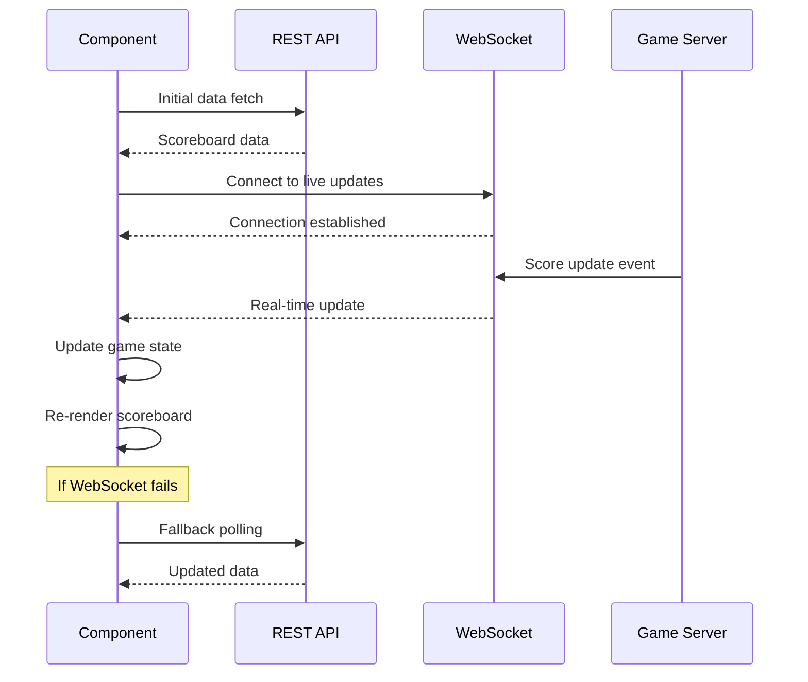

# LiveScoreboard Component

## Overview
The LiveScoreboard component displays real-time scoreboard data with automatic updates via WebSocket connections. It provides a responsive interface for viewing multiple games and their current status.

## Installation & Import

```javascript
import { LiveScoreboard } from '../components/LiveScoreboard';
```

## Basic Usage

```jsx
import React from 'react';
import { LiveScoreboard } from '../components/LiveScoreboard';

function App() {
  return (
    <div className="app">
      <LiveScoreboard />
    </div>
  );
}
```

## Props

### LiveScoreboard Props

| Prop | Type | Required | Default | Description |
|------|------|----------|---------|-------------|
| `apiEndpoint` | `string` | No | `/api/scoreboard` | API endpoint for fetching scoreboard data |
| `wsEndpoint` | `string` | No | `/ws/scoreboard` | WebSocket endpoint for live updates |
| `refreshInterval` | `number` | No | `30000` | Fallback polling interval in ms when WebSocket fails |
| `maxGames` | `number` | No | `undefined` | Maximum number of games to display |
| `showCompleted` | `boolean` | No | `true` | Whether to show completed games |
| `showUpcoming` | `boolean` | No | `true` | Whether to show upcoming games |
| `compact` | `boolean` | No | `false` | Use compact layout for smaller screens |
| `onGameClick` | `function` | No | `undefined` | Callback when a game is clicked |
| `onError` | `function` | No | `undefined` | Error handler callback |
| `className` | `string` | No | `''` | Additional CSS classes |
| `theme` | `'light' \| 'dark'` | No | `'light'` | Visual theme |

### Prop Types Definition

```typescript
interface LiveScoreboardProps {
  apiEndpoint?: string;
  wsEndpoint?: string;
  refreshInterval?: number;
  maxGames?: number;
  showCompleted?: boolean;
  showUpcoming?: boolean;
  compact?: boolean;
  onGameClick?: (game: Game) => void;
  onError?: (error: Error) => void;
  className?: string;
  theme?: 'light' | 'dark';
}

interface Game {
  gameId: string;
  homeTeam: Team;
  awayTeam: Team;
  status: GameStatus;
  period: number;
  timeRemaining: string;
  startTime: string;
  lastPlay?: string;
}

interface Team {
  id: string;
  name: string;
  abbreviation: string;
  score: number;
  logo: string;
}

type GameStatus = 'scheduled' | 'live' | 'halftime' | 'final' | 'postponed';
```

## Advanced Usage Examples

### Custom Configuration
```jsx
<LiveScoreboard
  apiEndpoint="/api/v2/scoreboard"
  wsEndpoint="/ws/live-scores"
  refreshInterval={15000}
  maxGames={6}
  showCompleted={false}
  compact={true}
  theme="dark"
  onGameClick={(game) => {
    console.log('Game clicked:', game.gameId);
    // Navigate to game details
  }}
  onError={(error) => {
    console.error('Scoreboard error:', error);
    // Handle error (show toast, etc.)
  }}
/>
```

### With Custom Styling
```jsx
<LiveScoreboard
  className="custom-scoreboard"
  theme="dark"
/>
```

```css
.custom-scoreboard {
  border-radius: 12px;
  box-shadow: 0 4px 6px rgba(0, 0, 0, 0.1);
}

.custom-scoreboard .game-card {
  background: linear-gradient(135deg, #667eea 0%, #764ba2 100%);
}
```

### Filtering Games
```jsx
<LiveScoreboard
  maxGames={4}
  showCompleted={false}
  showUpcoming={true}
/>
```

## Component State & Hooks

The LiveScoreboard component manages the following internal state:

```typescript
interface ScoreboardState {
  games: Game[];
  loading: boolean;
  error: string | null;
  connected: boolean;
  lastUpdated: string;
}
```

### Custom Hooks Used

#### useWebSocket
```typescript
const useWebSocket = (url: string, onMessage: (data: any) => void) => {
  // Returns: { connected, error, disconnect, reconnect }
};
```

#### useScoreboardData
```typescript
const useScoreboardData = (apiEndpoint: string) => {
  // Returns: { data, loading, error, refetch }
};
```

## Real-time Update Flow



## Event Handling

### WebSocket Event Handlers

The component automatically handles various WebSocket events:

#### Score Updates
```javascript
// Handled internally - updates specific game score
{
  type: 'score_update',
  data: { gameId, teamId, newScore, play }
}
```

#### Game Status Changes
```javascript
// Updates game status (live, halftime, final, etc.)
{
  type: 'game_status_change',
  data: { gameId, newStatus, previousStatus }
}
```

#### Time Updates
```javascript
// Updates game time and period
{
  type: 'time_update',
  data: { gameId, timeRemaining, period }
}
```

### Error Handling

The component provides comprehensive error handling:

```jsx
<LiveScoreboard
  onError={(error) => {
    switch (error.type) {
      case 'NETWORK_ERROR':
        showToast('Connection lost. Retrying...');
        break;
      case 'API_ERROR':
        showToast('Failed to load scoreboard data');
        break;
      case 'WEBSOCKET_ERROR':
        console.log('WebSocket failed, using polling fallback');
        break;
    }
  }}
/>
```

## Styling & Themes

### Default Classes
```css
.live-scoreboard {
  /* Container styles */
}

.scoreboard-header {
  /* Header with title and last updated */
}

.games-grid {
  /* Grid layout for games */
}

.game-card {
  /* Individual game styling */
}

.game-card.live {
  /* Live game highlighting */
}

.team-info {
  /* Team name, logo, score */
}

.game-status {
  /* Status badge (Live, Final, etc.) */
}

.loading-spinner {
  /* Loading state */
}

.error-message {
  /* Error display */
}
```

### Theme Variables
```css
/* Light theme */
.live-scoreboard.light {
  --bg-primary: #ffffff;
  --bg-secondary: #f8f9fa;
  --text-primary: #212529;
  --text-secondary: #6c757d;
  --accent-color: #007bff;
  --error-color: #dc3545;
  --success-color: #28a745;
}

/* Dark theme */
.live-scoreboard.dark {
  --bg-primary: #1a1a1a;
  --bg-secondary: #2d2d2d;
  --text-primary: #ffffff;
  --text-secondary: #b0b0b0;
  --accent-color: #0d6efd;
  --error-color: #e74c3c;
  --success-color: #27ae60;
}
```

## Performance Considerations

### Optimization Features
- **Memoized rendering** - Games only re-render when their data changes
- **Virtual scrolling** - For large numbers of games (auto-enabled when >20 games)
- **Connection pooling** - Reuses WebSocket connections
- **Smart polling** - Reduces API calls when WebSocket is connected
- **Image lazy loading** - Team logos load on demand

### Memory Management
```javascript
// Component automatically cleans up:
useEffect(() => {
  return () => {
    websocket?.close();
    clearInterval(pollingInterval);
  };
}, []);
```

## Accessibility

The component includes full accessibility support:

- **ARIA labels** for screen readers
- **Keyboard navigation** for game cards
- **Focus management** for interactive elements
- **High contrast** theme support
- **Reduced motion** respect for animations

```jsx
// ARIA attributes automatically applied
<div
  role="region"
  aria-label="Live Scoreboard"
  aria-live="polite"
  aria-busy={loading}
>
```

## Testing

### Unit Test Example
```javascript
import { render, screen, waitFor } from '@testing-library/react';
import { LiveScoreboard } from './LiveScoreboard';

test('displays games when loaded', async () => {
  render(<LiveScoreboard />);
  
  await waitFor(() => {
    expect(screen.getByText('Lakers')).toBeInTheDocument();
    expect(screen.getByText('Warriors')).toBeInTheDocument();
  });
});

test('handles WebSocket updates', async () => {
  const mockWS = new MockWebSocket();
  render(<LiveScoreboard />);
  
  mockWS.send({
    type: 'score_update',
    data: { gameId: 'game_123', teamId: 'team_456', newScore: 100 }
  });
  
  await waitFor(() => {
    expect(screen.getByText('100')).toBeInTheDocument();
  });
});
```

## Browser Support

- **Modern browsers**: Chrome 60+, Firefox 55+, Safari 12+, Edge 79+
- **WebSocket support**: Required for real-time updates
- **Fallback**: Automatic polling for older browsers without WebSocket support

## Troubleshooting

### Common Issues

1. **WebSocket connection fails**
   - Component automatically falls back to polling
   - Check network/firewall settings
   - Verify WebSocket endpoint URL

2. **Games not updating**
   - Check API endpoint accessibility
   - Verify data format matches expected schema
   - Check browser console for errors

3. **Performance issues**
   - Enable `compact` mode for large datasets
   - Reduce `refreshInterval` if needed
   - Check for memory leaks in custom handlers

### Debug Mode
```jsx
<LiveScoreboard
  onError={(error) => console.error('Debug:', error)}
  refreshInterval={5000} // Faster updates for debugging
/>
```